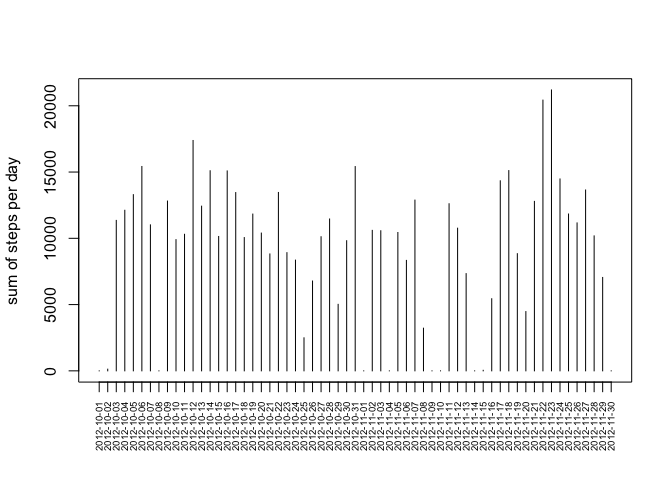
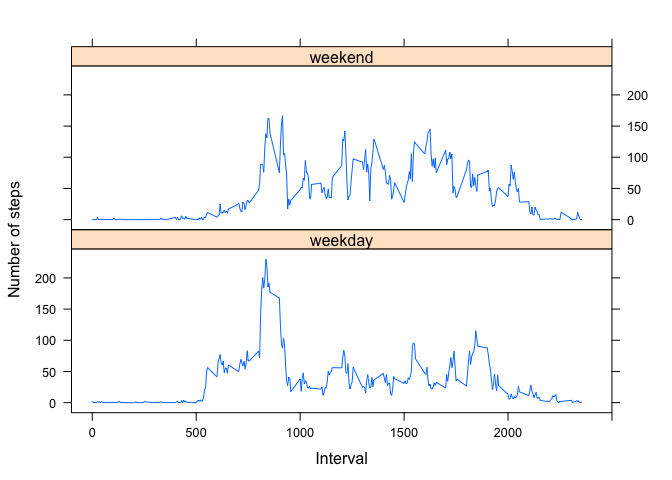

# Reproducible Research: Peer Assessment 1
##

```r
setwd("/Users/jochen/Documents/Coursera_DS/Reproducible_Research/PeerAssessment1/RepData_PeerAssessment1")
```

For the given tasks, I will make use of the 'dplyr' package.

```r
library(dplyr)
```

```
## 
## Attaching package: 'dplyr'
## 
## The following objects are masked from 'package:stats':
## 
##     filter, lag
## 
## The following objects are masked from 'package:base':
## 
##     intersect, setdiff, setequal, union
```

## Loading and preprocessing the data
Preliminary remark: I suppose that the user of this program has set his working directory appropriately, so that when running the code, th eprogram will find the data frame "activity.csv".


```r
rawdata <- read.csv("activity.csv")
```

After inspection of the data, I considered that there was no need for preprocessing the data. The dataset contains 17568 recors of three variables, "steps", "date", and "interval". The date column is of class factor, the levels indicate dates in the format "yyyy-mm-dd". There are 61 levels, that is the observation period covers 61 days. The interval takes integer values of the form "hhmm", whereby leading zeros are obviuosly not present. Since the interval represent a 5-minutes period, there are 12 x 24 = 288 intervals each day. The number of records of the dataset is thus explained by 17568 = 61 x 288.

## What is mean total number of steps taken per day?
As recommended, I will ignore the missing values, that is I will retain only the records that contain no missing values by using the R function "complete.cases".

```r
## Filtering the rows where there is a missing value
good <- complete.cases(rawdata)
filtdata <- rawdata[good,]
```
The histogram is produced with the R function "plot", using type = "h". For the construction of the time series, I split the data of the "steps" column with respect to the column "date" (which is already a factor), and apply the "sapply" function with "sum". 


```r
## Histogram of total number of steps per day (ignoring missing values)
ts <- sapply(split(filtdata$steps,filtdata$date), sum)
plot(ts, xaxt="n", type = "h", ylab = "sum of steps per day", xlab="")
axis(1, at= 1:length(ts), labels = names(ts), las=2, cex.axis =0.6)
```

 

```r
## Mean and median over the total steps per day
meantotal <- format(mean(ts), nsmall=2)
mediantotal <- median(ts)
```
The mean of the daily total steps is 9354.23 and the median of the daily total
is 10395.

## What is the average daily activity pattern?
The representation of the average daily activity pattern by interval involves 288 values for the x-axis. I will use the plot function, using as recommended type = "l".
For constructing the time series, I now split on the "steps" column with respect to the "interval" column, and then use "sapply" with now the "mean" function. This produces a numeric vector of length 288 (as expected). The names of the vector are the intervals, that I use for defining the x-axis.


```r
## Plot of timeseries 
avgactivity <- sapply(split(filtdata$steps,filtdata$interval), mean)
n <- names(avgactivity)
plot(x=n, y= avgactivity, type="l", mar = c(5.1,4.1, 4.1, 2.1), 
      main = "average activity across days per interval",
      xlab ="5-minute interval of the day", ylab = "average activity across days")
```

 

```r
## Interval with maximum average activity across the days
maxinterval <- names(avgactivity[avgactivity==max(avgactivity)])
maxavg <- format(as.numeric(max(avgactivity)), nsmall=2)
```
The 5-minute interval, on average across all the days in the dataset, which contains the maximum number of steps is the interval 835. The average number of steps in this interval is 206.1698.

## Imputing missing values
For calculating the number of missing values (these are only in the "steps" column), I filter the missing data with the "is.na" function. I make use of the "filter" function of the dplyr package, so it is important that this package has been loaded beforehand. The first dimension of the obtained new table provides the number of missing values.


```r
## Calculating number of rows with missing values
missingdata <- filter(rawdata, is.na(steps))
nbmd <- dim(missingdata)[1]
```
There are 2304 missing values for the variable 'steps', equivalent to the number of rows of the dataset with missing values.

### Strategy for missing values
From the analysis so far, I consider that most of the missing values are concentrated on a restricted number of days, and I will confirm this by an additional analysis. Indeed it turns out that the 2304 are concentrated on 8 days and for these days, no values exist (2304 = 288 x 8; 288 being the number of intervals per day). 


```r
distribution_na <- group_by(missingdata, date)
summarize(distribution_na, number_na = length(steps))
```

```
## Source: local data frame [8 x 2]
## 
##         date number_na
## 1 2012-10-01       288
## 2 2012-10-08       288
## 3 2012-11-01       288
## 4 2012-11-04       288
## 5 2012-11-09       288
## 6 2012-11-10       288
## 7 2012-11-14       288
## 8 2012-11-30       288
```

Furthermore, given the strong intraday activity pattern, I consider that it makes sense to replace the missing values by the average across days of the number of steps by interval such as calculated above. 
For that purpose, I group the original dataset by the "interval" column, then create a new column in the dataframe that represents for each record (and therefore each given interval) the average number of steps of the interval across days, whereby I obviously ignore missing values when calculating the mean. In a next step, I create a new column where the missing value is replaced by the average, choosing the value from the previously created column whenever the value is missing in the "steps" column.  


```r
rawdata.gint <- group_by(rawdata, interval)
data.help1 <- mutate(rawdata.gint, steps.avgint = mean(steps, na.rm=TRUE))
data.help2 <- ungroup(data.help1)
newData <- mutate(data.help2, steps.corr =
                        ifelse(is.na(steps),steps.avgint, steps))
```

### Histogram of total number of steps each day
The histogram integrates the replacement of missing values by the average by interval. I essentially use the same code (and parameters) as above to create this histogram.

```r
## Histogram of total number of steps per day 
ts2 <- sapply(split(newData$steps.corr,newData$date), sum)
plot(ts2, xaxt="n", type = "h", ylab = "sum of steps per day", xlab="")
axis(1, at= 1:length(ts2), labels = names(ts2), las=2, cex.axis =0.6)
```

 

One observes in the histogram that even after replacing all missing values, there is only small activity on 2 dates: 2 October and 15 November. Indeed, nearly all intervals on these 2 days take the value 0. I do not further investigate this issue.


```r
meantotal2 <- format(mean(ts2), nsmall=2)
mediantotal2 <- format(median(ts2), nsmall=2)
```
By replacing missing values, the mean of the daily total steps is 10766.19 and the median of the daily total is 10766.19. Notice that the mean and median are the same, which is at first sight quite astonishing. But since the days that originally only contained only missing values have ben replaced by mean values across days, these days represent the mean values of the other days. And there were 8 such days among the 61, so it becomes quite intuitive that one such day may represent the median of all days.

## Are there differences in activity patterns between weekdays and weekends?

### Preparatory steps
To avoid problems for users that run their machines not in the appropriate language environment, I set this environment to "en_US.UTF-8" via the Sys.setlocale function. I then define a function that I call somewhat ambiguosly "dayofweek" that allows defining a binary variable that distinguishes between weekend ("Sat", "Sun") and the weekday (the other days). furthermore, since I will use again functions from the "dplyr" package, it is important that this package has been loaded.

```r
## Setting system to English for use of Englsih output from the weekdays function
Sys.setlocale("LC_TIME", "en_US.UTF-8")
```

```
## [1] "en_US.UTF-8"
```

```r
## Creating a factor day of weed that allows to distinguish weekday and weekend
wd <- weekdays(as.Date(newData$date), abbreviate = TRUE)
dayofweek = function(x){
      if(x == "Sat" | x == "Sun") {"weekend"}
      else {"weekday"}
}
```

### Coding the plot
I add the newly obtained variable "dayofweek" to the dataframe where missing values have been replaced by the average activity across days per interval. I then select the columns of interest (interval, dayofweek, steps.corr), then group by "interval" and the "dayofweek" variable. The dplyr-package function "summarize" is used for defining the requested statistics (mean).


```r
newData$dayofweek <- sapply(wd, FUN=dayofweek)
newData.sel <- select(newData, interval, dayofweek, steps.corr)
newData.selg <- group_by(newData.sel, interval, dayofweek)
plotData <- summarise(newData.selg, avgsteps = mean(steps.corr))

## Plot the panel graph
library(lattice)
plotData$interval <- as.character(plotData$interval)
xyplot(plotData$avgsteps ~ plotData$interval | plotData$dayofweek, layout = c(1,2), type = "l", xlab = "Interval", ylab="Number of steps", xlim = c(-100, 0,500, 1000, 1500, 2000, 2500))
```

 

A comparison of the plots shows that on weekdays, there is a clear peak in the morning at about 9:00, whereas a peak of activity before 10:00 (actually a double peak) is less pronounced during the weekend. Also, activity begins later the day during the weekend than on weekdays. Furthermore, apart from the morning peak, activity is somewhat higher during weekends than on weekdays, with some peaks reaching 150 steps during the weekend.
